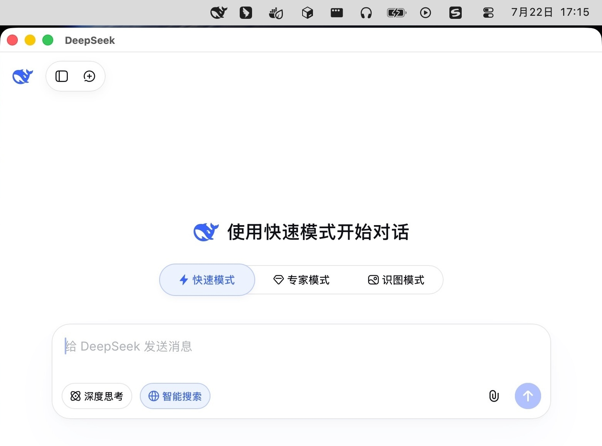

# Tingly DS

Tingly DS is a small Go/Wails 3 desktop wrapper for
`https://chat.deepseek.com/`. Its Go module is
`github.com/tingly-dev/tingly-ds`. It uses the operating-system WebView rather
than bundling Chromium and provides a normal application window plus a
menu-bar/system-tray entry on macOS, Windows, and Linux.

## Preview



## Behaviour

- The window opens on launch and remains available from the application icon and
  system tray.
- Clicking the tray icon shows or hides the window.
- The tray menu provides Show, Hide, Reload, Open in Browser, and Quit.
- Closing the window or pressing Escape hides it without ending the process.
- DeepSeek links stay embedded; unrelated HTTP(S) anchor links open in the
  default browser.

On Linux, tray visibility depends on status-notifier support in the desktop
environment. Some GNOME installations require an AppIndicator extension.

## User data and login persistence

Tingly DS uses each operating system WebView's persistent website-data store.
DeepSeek cookies, local storage, and cache live outside the application artifact,
so replacing the `.app`, `.exe`, or AppImage does not normally reset login:

- macOS: WKWebView data under the user's Library.
- Windows: WebView2 data under the user's local application data.
- Linux: WebKitGTK data under the user's XDG data/cache directories.

The packaged identity must remain stable for the WebView to find the same
profile:

- application identifier: `dev.tingly.tingly-ds`
- executable/program name: `tingly-ds`

A binary started through the development workflow may use a separate profile.
Changing the identity or manually clearing native WebView data can require
signing in again.

## Common requirements

- Go 1.25 or newer.
- Wails CLI matching the pinned module version:

  ```sh
  go install github.com/wailsapp/wails/v3/cmd/wails3@v3.0.0-alpha2.114
  ```

Wails 3 is prerelease software. Re-run the complete native smoke-test checklist
before changing its pinned version.

### macOS

- macOS 12 or newer.
- Xcode Command Line Tools (`xcode-select --install`) for the compiler,
  `iconutil`, and `codesign`.

### Windows

- Windows 10 or 11.
- Microsoft Edge WebView2 Runtime. Current Windows installations normally have
  the evergreen runtime; otherwise install it from Microsoft.
- A native Go/Wails build environment. No NSIS or MSIX tooling is needed for the
  baseline `.exe` artifact.

### Linux

- A desktop Linux distribution with GTK3, WebKitGTK, and system-tray/AppIndicator
  support.
- A C compiler and the development packages required by Wails. Package names
  vary by distribution; run `wails3 doctor` for host-specific guidance.
- Network access while creating an AppImage, because the Wails generator obtains
  its AppImage tooling during packaging.

## Build from source

```sh
git clone https://github.com/tingly-dev/tingly-ds.git
cd tingly-ds
go install github.com/wailsapp/wails/v3/cmd/wails3@v3.0.0-alpha2.114
go mod download
wails3 task test
wails3 task build
```

The native development artifact is written to `bin/tingly-ds` on macOS/Linux or
`bin/tingly-ds.exe` on Windows.

## Develop

```sh
go mod download
wails3 task test
wails3 task run
```

For file watching:

```sh
wails3 dev -config ./build/config.yml
```

## Package

Run the same command on the target operating system:

```sh
wails3 package
```

It dispatches to the current platform:

| Platform | Artifact | Notes |
| --- | --- | --- |
| macOS | `bin/TinglyDS.app` | Ad-hoc signed for local use |
| Windows | `bin/tingly-ds.exe` | GUI executable with icon, manifest, and version resources |
| Linux | `bin/tingly-ds-*.AppImage` | AppImage with freedesktop desktop metadata |

You can also call `wails3 task package:darwin`, `package:windows`, or
`package:linux` explicitly on the matching host. Linux and Windows artifacts
must be built natively; Linux requires CGO and its WebKitGTK libraries.

The generated artifacts are unsigned release baselines. Public macOS distribution
still requires Developer ID signing and notarisation; Windows distribution
should use Authenticode and an installer; Linux repository packages should be
signed according to the target distribution. NSIS, MSIX, deb, rpm, and Arch
packages are not part of the current baseline.

## Native release verification

Before publishing a build on each target, launch the packaged artifact and
verify:

1. DeepSeek loads and login succeeds.
2. close and Escape hide without quitting;
3. tray click and every tray menu action work;
4. login survives quit, relaunch, and artifact replacement;
5. unrelated links open in the default browser while DeepSeek links remain in
   the app;
6. upload, download, microphone, camera, clipboard, and notifications behave as
   expected for the native WebView.

Build metadata and Go tests can be checked on any host, but WebView2 and
WebKitGTK runtime behavior must be exercised on Windows and Linux respectively.

The app and tray marks are DeepSeek assets downloaded from
[LobeHub Icons](https://lobehub.com/icons/deepseek). Their exact source URLs,
checksums, and Lobe Icons licence notice are recorded in
`THIRD_PARTY_NOTICES.md`.

## Security model

- No Go service is registered for page JavaScript.
- Wails simple event emission, native file-drop bridging, and release DevTools
  are disabled.
- Web permissions use the operating-system prompt/default policy.
- The sole raw bridge message can only request that a validated HTTP(S) URL be
  opened in the system browser, and only from the main DeepSeek frame.
- The Windows manifest runs with the caller's standard privileges and does not
  request elevation.

External-link interception is deliberately small and best-effort. DeepSeek can
change its frontend or login flow, so repeat the native verification checklist
after major website or WebView updates.
